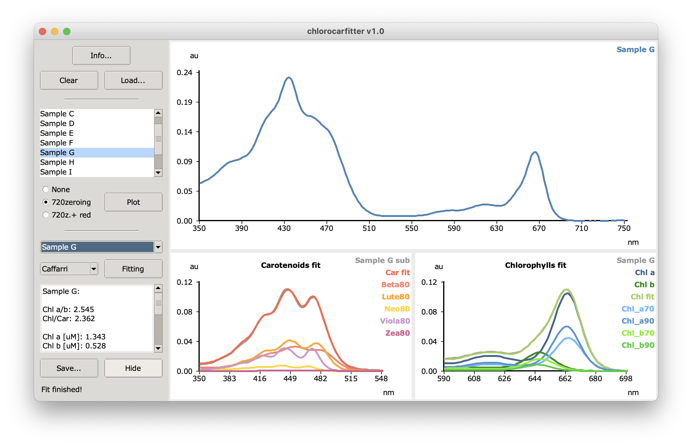

This is chlorocarfitter, a tool for the quantification of pigments in acetonic solution. It's available for Windows, MacOS, and Linux. What follows gives you a brief description of its usage. 



### Installing

Go to <www.github.com/lazzarigioele/chlorocarfitter/releases> and selected the executable according to your operating system. Windows 10+, MacOS 11+, and Ubuntu 18+ are supported (64bit version). Double-click on the executable to open the application. Note: on MacOS you could see the message "cannot be opened because the developer cannot be verified". In this case, right click on the .app and select "Open", than confirm. Note: on Linux the bin file should start with a double-click; anyway, you could have to mark the .bin file as "executable" and then launch it from the command line.

### Loading of samples

First, load an Excel file or a .CSV file containing all your samples. Excel files must have the `.xlsx` extension (Excel 2007 and newer). The file to load must contain the wavelengths in the first column, followed by all the individual samples. The first row must contain the labels. Do not include spectroscopy blanks into this file. The `testfiles` folder in GitHub contains several .CSV and .xlsx example files to test Chlorocarfitter. 

What follow is an extract of an example .CSV file:

    nm,control,treated A,treated B
    350,0.213394,0.20994,0.251385
    350.2,0.213539,0.210048,0.25159
    350.4,0.213823,0.210502,0.252051
    350.6,0.213868,0.210699,0.25238
    350.8,0.214231,0.2108,0.252692
    351,0.214519,0.210976,0.25285

As you can see, the .CSV file should use a "," delimiter. Anyway, also ";" and "\t" delimiters are supported. More specifically, these combinations are valid:
- delimiter "," decimal separator "." 
- delimiter ";" decimal separator "."
- delimiter ";" decimal separator ","
- delimiter "\t" decimal separator "."


Spectra can be zeroed, but this is not necessary due to the automatic zeroing at 720nm feature. Spectra should be recorded in ascending order, but this in not necessary due to the automatic inversion feature. 

We recommend a spectrum from 350-750nm with 0.4nm interval steps. However, the programm works fine with many different intervals (0.5nm, 0.2nm, 0.1nm, etc). For a complete fitting, each spectrum should be at least in the region 400-725nm (since zeroing is performed at 720nm and carotenoids are fitted from ~400nm and higher).

Subsequent loading of a new file will first clear the program memory. You can click on the "Clear" button to manually clear the memory. 

### Visualization of samples

Once loaded, samples names are displayed in list. You can select as many samples as you want and that click con "Plot" to show them. You can zoom in by dragging a rectangle over the area of interest. Zooming out occurs by a right-click on your mouse. A double right-click cleans-up the canvas.

### Zeroing of samples

If selected, option "720zeroing" will zero all the samples at 720nm.

If selected, option "720z.+ red" will zero all the samples at 720nm, and then normalize them on the red peack, which means that the maximum absorbance on the red region will be 1a.u.

### Executing the fit

If selected, option "Porra" enable the classic Porra equations. Clicking on "Calculate" will show up Chl a and Chl b concentrations both in ug/uL and in nmol/uL. A Chl a/b ratio is also displayed. With "Porra" the normalization factor is ignored.

If selected, option "Caffarri" enable a fitting using the Non-Negative Least Squares algorithm, in the classic version of Lawson-Hanson. Clicking on "Fitting" will show up the pigments' concentrations in uM. Pigments considered are: Chl a, Chl b,  Chl (total cholorophyll), Beta80 (beta-carotene), Lute80 (lutein), Neo80 (neoxanthin), Viola80 (violaxanthin), Zea80 (zeaxanthin). Chl a/b and Chl/Car ratios are also provided. Clicking on "Fitting" will also show up the graphical spectrum decomposition. Concentrations in uM are divided by the normalization factor specified by the user (default: 1).

### Saving the results

The button 'Save...' automatically fits all the different samples using the algorithm specified, and saves the results in an Excel file. Here, the normalization factor is ignored.

### Bugs and future versions

Bugs can be reported to <gioele.lazzari@univr.it>. Future versions of chlorocarfitter will be available at <www.github.com/lazzarigioele/chlorocarfitter/releases>.

### How to cite

Publication in progress!
If you use this software in your work, remember to specify the chlorocarfitter's version, which is visible in the title bar.

### Technical notes

Older versions of this software used `numpy` to handle the matrix algebra underlying the spectrum decomposition, and `matplotlib` to show the plots. Anyway, this approach led to extremely heavy executables (more than 100MB) geerated with `pyinstaller` (pyinstaller.org). In order to keep small the size of the executables, Chlorocarfitter has been re-written using exclusively the Python Standard Library (so the graphing and matrix algebra methods were rewritten from scratch). Reading and writing MS spreadsheets is possible thanks to the the `pylightxl` code (pylightxl.readthedocs.io), which holds the MIT licence. 

The minimal development environment is given by:

```bash
conda create --name chlorocarfitter -y
conda activate chlorocarfitter
conda install python==3.7.10 pyinstaller==4.5.1 -c conda-forge
```

To build the executable for MacOS 11+:
```
pyinstaller -y -F -w -i "icons/icon_macos_chlorocarfitter.icns" --add-data "README.md:." --add-data "standards/*:./standards" --add-data "icons/icon_chlorocarfitter.gif:./icons" --name "chlorocarfitter_MacOS11" "chlorocarfitter.py"
```

To build the executable for Windows 10+:
```
pyinstaller -y -F -w -i "icons/icon_windows_chlorocarfitter.ico" --add-data "README.md;." --add-data "standards/*;./standards" --add-data "icons/icon_chlorocarfitter.gif;./icons" --name "chlorocarfitter_Windows10" "chlorocarfitter.py"
```

To build the executable for Ubuntu 18+:
```
pyinstaller -y -F -w --add-data "README.md:." --add-data "standards/*:./standards" --add-data "icons/icon_chlorocarfitter.gif:./icons" --name "chlorocarfitter_Ubuntu18.bin" "chlorocarfitter.py"
```

`-F` / `-D`: one file / one directory.
`-w`: Windows and MacOS: do not provide a console window for standard i/o.
`-y`: Replace output directory (default: SPECPATH/dist/SPECNAME) without asking for confirmation.
`-i`: Adds the specified icon (.ico on Windows, .icns on MacOS)
`--add-data`: Adds the specified files to the bundle. The path separator is ; on Windows and : on most Unix systems.
